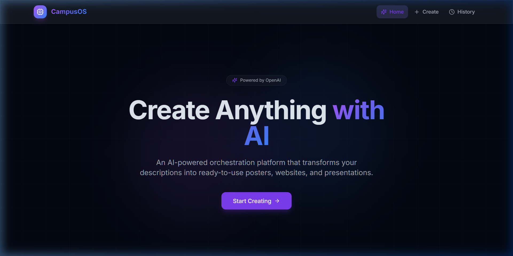
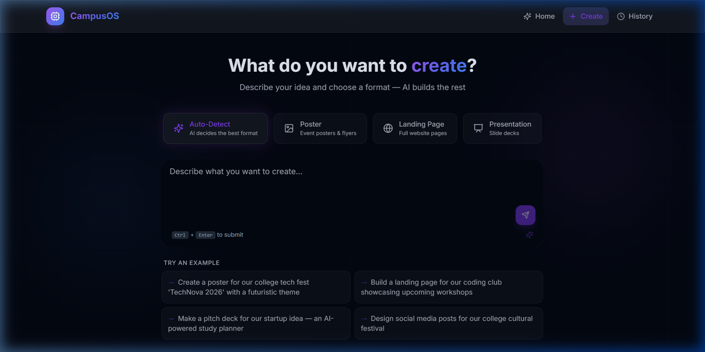
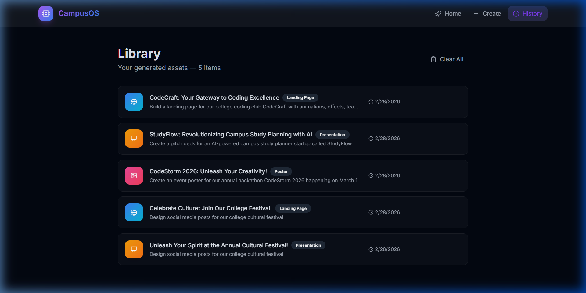
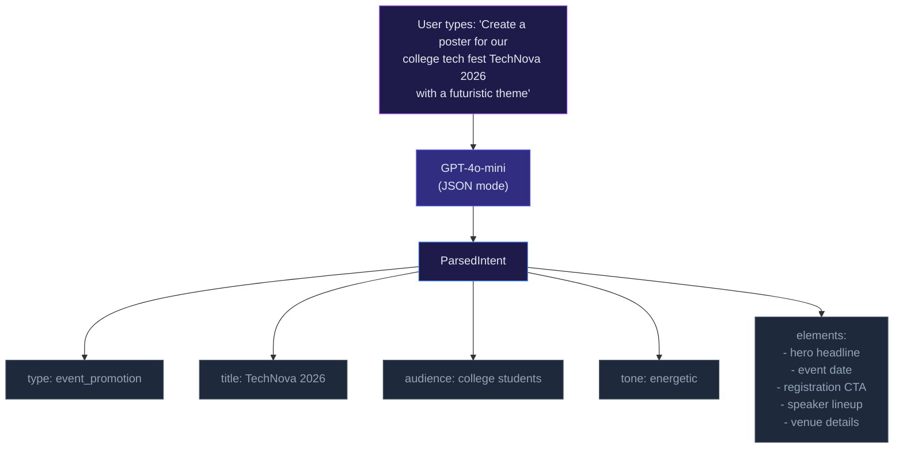
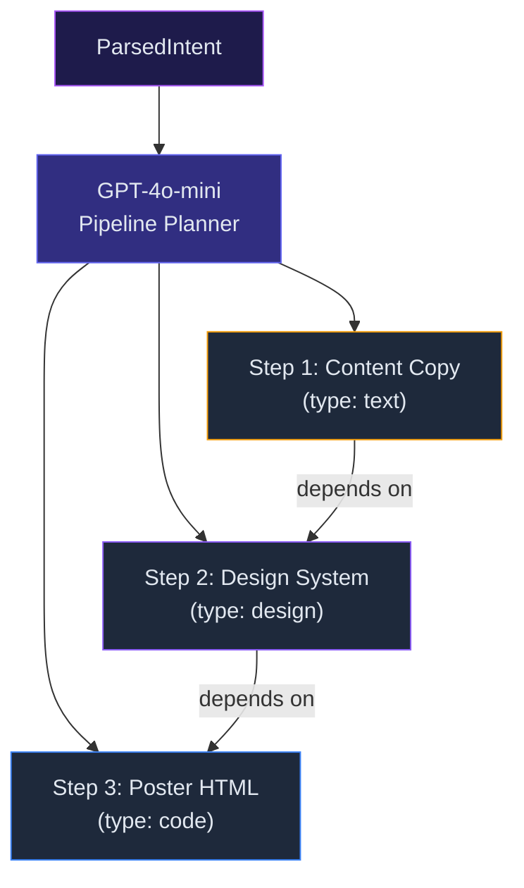
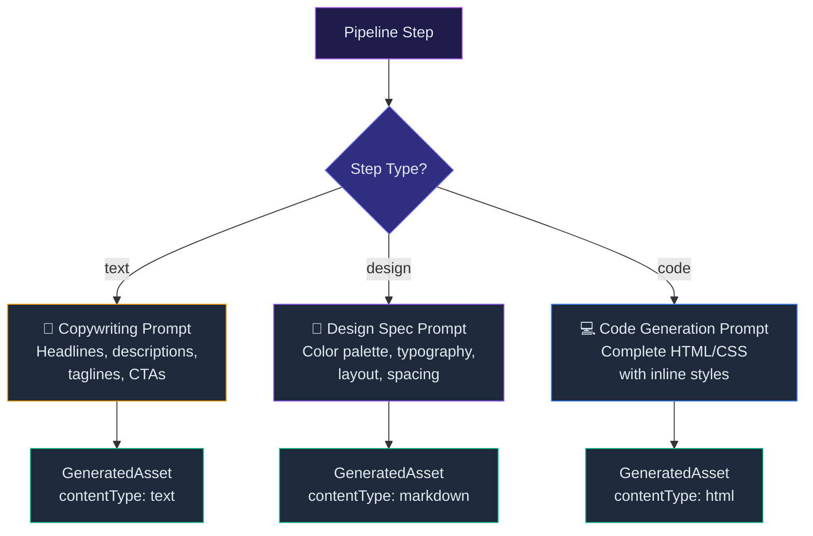
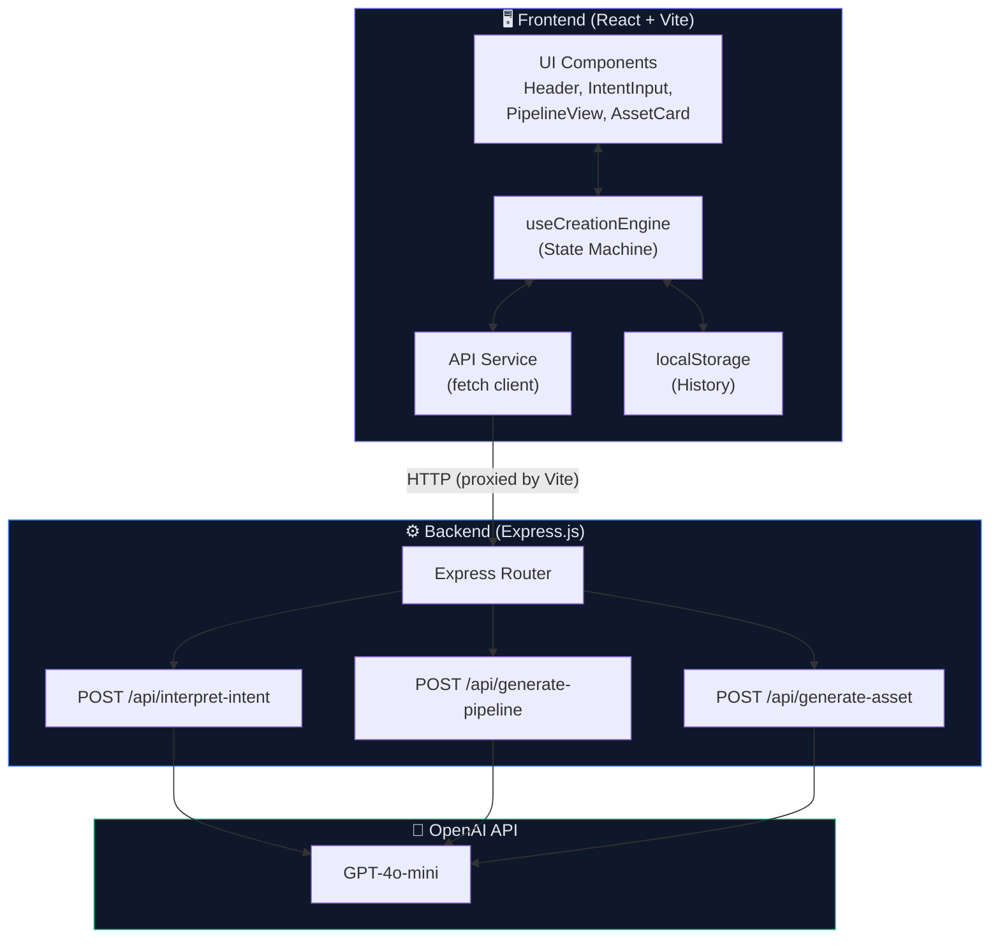
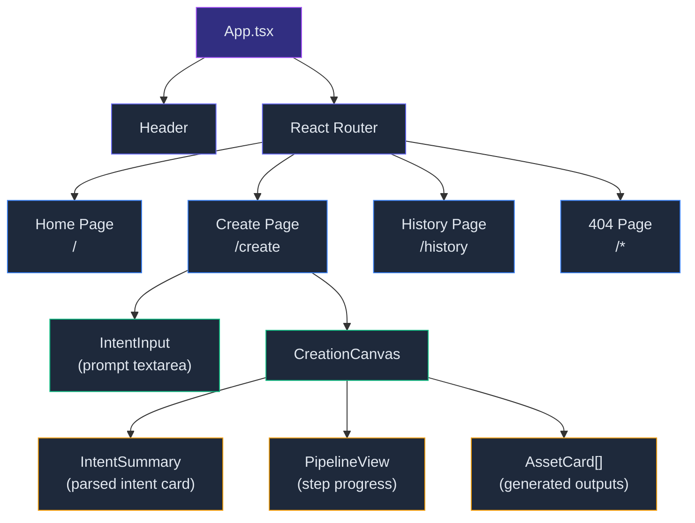
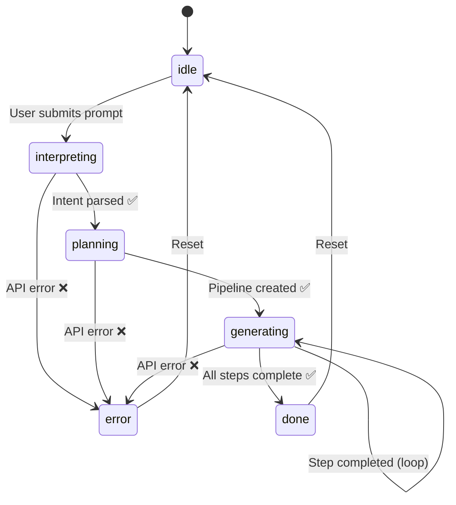
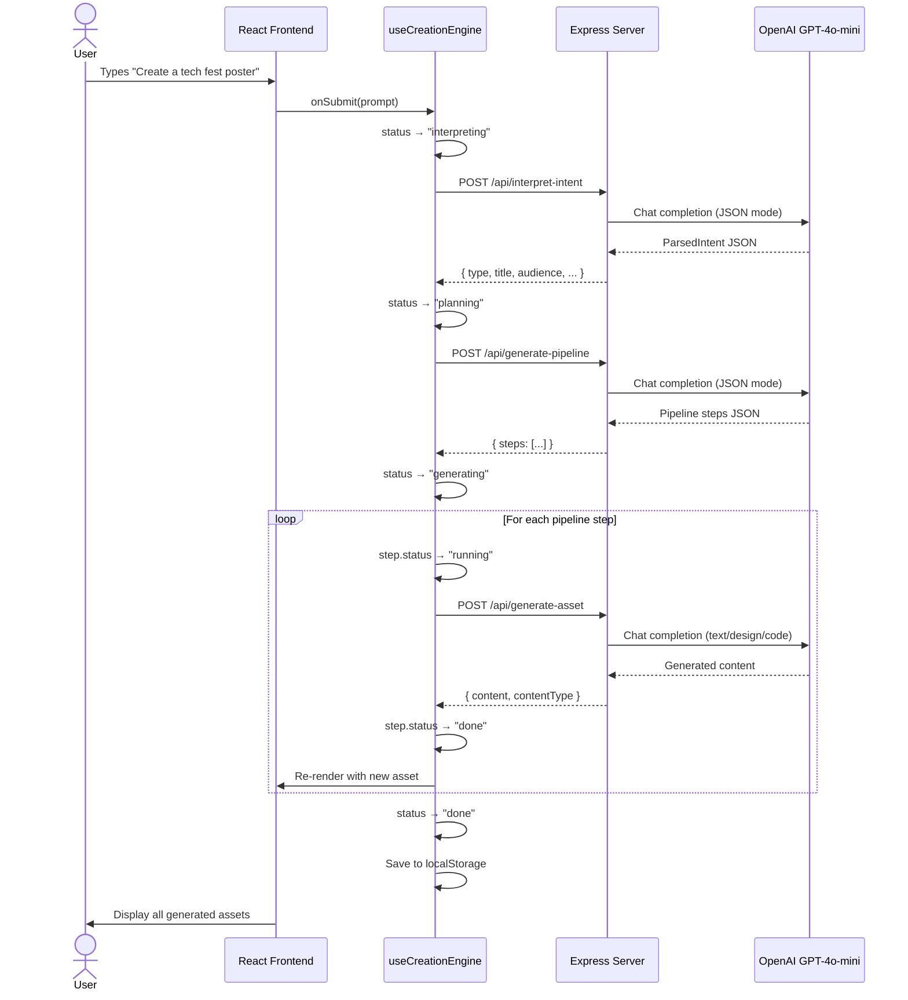

<p align="center">
  
</p>

<h1 align="center">CampusOS</h1>

<p align="center">
  <strong>AI-Powered Asset Orchestration Platform for College Students</strong>
</p>

<p align="center">
  <a href="#-quick-start">Quick Start</a> •
  <a href="#-how-it-works">How It Works</a> •
  <a href="#-architecture">Architecture</a> •
  <a href="#-api-reference">API Reference</a> •
  <a href="#-project-structure">Project Structure</a> •
  <a href="#-screenshots">Screenshots</a>
</p>

<p align="center">
  
  
  
  
  
</p>

---

## 🎯 What Is CampusOS?

CampusOS transforms natural language descriptions into **ready-to-use digital assets** — posters, landing pages, and presentations — tailored for college students. Describe what you need, and the AI handles the rest.

**No Supabase. No Gemini. Pure OpenAI.**

### Supported Creation Types

| Type | What You Get | Example Prompt |
|------|-------------|----------------|
| 🎪 **Event Promotion** | Posters, flyers, social media content | *"Create a poster for our college tech fest TechNova 2026"* |
| 🌐 **Landing Pages** | Complete HTML/CSS websites | *"Build a landing page for our coding club showcasing workshops"* |
| 📊 **Presentations** | Slide decks, pitch presentations | *"Make a pitch deck for our AI-powered study planner startup"* |

---

## 📸 Screenshots

### Home Page
> Hero section with gradient effects, feature cards, and call-to-action



### Create Page
> AI prompt input with example suggestions and keyboard shortcut



### History Page
> Browse and manage your past creations (stored locally)



---

## 🔄 How It Works

The entire creation flow runs through **3 AI-powered stages**, each calling a dedicated API endpoint powered by OpenAI's GPT-4o-mini:


### Stage 1 — Intent Interpretation

The user types a natural language description. The AI parses it into a structured `ParsedIntent`:



### Stage 2 — Pipeline Generation

The parsed intent is sent to the AI to create an **ordered execution plan**:



### Stage 3 — Asset Generation

Each pipeline step is executed **sequentially**. The AI generates content based on the step type:



---

## 🏗️ Architecture

### System Architecture



### Frontend Component Tree



### State Machine — `useCreationEngine`

The entire creation flow is managed by a state machine hook:



---

## 🚀 Quick Start

### Prerequisites

- **Node.js 18+**
- **OpenAI API Key** — [Get one here](https://platform.openai.com/api-keys)

### 1. Clone & Install

```bash
git clone https://github.com/nitinog10/Campus-Os.git
cd Campus-Os

# Install frontend dependencies
npm install

# Install server dependencies
cd server && npm install && cd ..
```

### 2. Configure OpenAI

```bash
# Edit the server .env file
# Replace sk-your-key-here with your actual OpenAI API key
```

`server/.env`:
```env
OPENAI_API_KEY=sk-proj-xxxxxxxxxxxx
```

### 3. Run Both Servers

**Option A — Two terminals:**

```bash
# Terminal 1: Frontend (http://localhost:5173)
npm run dev

# Terminal 2: Backend API (http://localhost:3001)
cd server && node server.js
```

**Option B — Single command:**

```bash
npm run dev:all
```

### 4. Open the App

Navigate to **http://localhost:5173** and start creating!

---

## 📡 API Reference

All endpoints accept and return JSON. The Vite dev server proxies `/api/*` requests to the Express backend on port 3001.

### `POST /api/interpret-intent`

Parses a natural language prompt into structured intent.

**Request:**
```json
{
  "prompt": "Create a poster for our college tech fest TechNova 2026 with a futuristic theme"
}
```

**Response:**
```json
{
  "type": "event_promotion",
  "title": "TechNova 2026",
  "description": "A futuristic-themed poster for a college technology festival",
  "audience": "college students and tech enthusiasts",
  "tone": "energetic",
  "elements": ["hero headline", "event date", "registration CTA", "tech visuals", "speaker lineup"],
  "rawPrompt": "Create a poster for our college tech fest..."
}
```

---

### `POST /api/generate-pipeline`

Creates an ordered execution plan from the parsed intent.

**Request:**
```json
{
  "intent": { ... }
}
```

**Response:**
```json
{
  "id": "uuid",
  "intentId": "TechNova 2026",
  "steps": [
    {
      "id": "uuid-step-0",
      "label": "Event Copy & Messaging",
      "description": "Generate headlines, taglines, and promotional copy",
      "stepType": "text",
      "status": "pending",
      "dependencies": [],
      "order": 1
    },
    {
      "id": "uuid-step-1",
      "label": "Visual Design System",
      "description": "Define color palette, typography, and layout",
      "stepType": "design",
      "status": "pending",
      "dependencies": ["uuid-step-0"],
      "order": 2
    },
    {
      "id": "uuid-step-2",
      "label": "Poster HTML/CSS",
      "description": "Generate the complete poster as HTML with inline styles",
      "stepType": "code",
      "status": "pending",
      "dependencies": ["uuid-step-1"],
      "order": 3
    }
  ],
  "createdAt": "2026-02-28T00:00:00.000Z"
}
```

---

### `POST /api/generate-asset`

Generates content for a single pipeline step.

**Request:**
```json
{
  "step": {
    "id": "uuid-step-0",
    "label": "Event Copy & Messaging",
    "description": "Generate headlines and promotional copy",
    "stepType": "text"
  },
  "intent": { ... }
}
```

**Response:**
```json
{
  "stepId": "uuid-step-0",
  "stepLabel": "Event Copy & Messaging",
  "content": "# TechNova 2026\n\n## Headline\n**The Future Starts Here**\n\n...",
  "contentType": "text",
  "explanation": "Generated text content for 'Event Copy & Messaging' using OpenAI GPT-4o-mini."
}
```

---

### `GET /api/health`

Health check endpoint.

```json
{
  "status": "ok",
  "timestamp": "2026-02-28T00:00:00.000Z"
}
```

---

## 🗂️ Project Structure

```
Campus-Os/
├── 📄 index.html                 # Root HTML entry
├── 📄 package.json               # Frontend dependencies & scripts
├── 📄 vite.config.ts             # Vite config (React SWC + API proxy)
├── 📄 tailwind.config.ts         # Tailwind with custom animations
├── 📄 tsconfig.json              # TypeScript config
├── 📄 README.md                  # ← You are here
│
├── 📁 public/
│   └── vite.svg                  # Gradient favicon
│
├── 📁 docs/
│   └── 📁 screenshots/           # App screenshots
│       ├── homepage.png
│       ├── create-page.png
│       └── history-page.png
│
├── 📁 src/                       # ── Frontend ──────────────────
│   ├── main.tsx                  # React entry point
│   ├── App.tsx                   # Router + layout shell
│   ├── index.css                 # Design system (glassmorphism, gradients)
│   ├── vite-env.d.ts             # Vite type declarations
│   │
│   ├── 📁 components/
│   │   ├── Header.tsx            # Glassmorphic nav with active route indicator
│   │   ├── IntentInput.tsx       # Prompt textarea + example prompts
│   │   ├── IntentSummary.tsx     # Parsed intent display card
│   │   ├── PipelineView.tsx      # Step-by-step progress tracker
│   │   ├── AssetCard.tsx         # Output card (preview/copy/download)
│   │   ├── CreationCanvas.tsx    # Orchestrates the creation flow UI
│   │   └── 📁 ui/               # shadcn/ui primitives
│   │       ├── button.tsx        # Button with glow variant
│   │       ├── card.tsx          # Card components
│   │       ├── textarea.tsx      # Text input
│   │       ├── badge.tsx         # Badge with glow variant
│   │       ├── progress.tsx      # Gradient progress bar
│   │       ├── separator.tsx     # Visual separator
│   │       ├── scroll-area.tsx   # Custom scrollbar
│   │       ├── skeleton.tsx      # Loading skeleton
│   │       └── toaster.tsx       # Toast notifications
│   │
│   ├── 📁 pages/
│   │   ├── Home.tsx              # Hero + features + creation types
│   │   ├── Create.tsx            # Main creation orchestration
│   │   ├── History.tsx           # Past creations list
│   │   └── NotFound.tsx          # 404 page
│   │
│   ├── 📁 services/
│   │   └── api.ts                # Typed REST client for backend
│   │
│   ├── 📁 hooks/
│   │   └── useCreationEngine.ts  # Core state machine hook
│   │
│   ├── 📁 types/
│   │   └── campusos.ts           # TypeScript interfaces
│   │
│   └── 📁 lib/
│       └── utils.ts              # cn() class merge utility
│
└── 📁 server/                    # ── Backend ───────────────────
    ├── package.json              # Server dependencies
    ├── server.js                 # Express entry (CORS, routes)
    ├── .env                      # OPENAI_API_KEY (git-ignored)
    ├── .env.example              # Template for .env
    │
    ├── 📁 lib/
    │   └── openai.js             # Shared OpenAI client instance
    │
    └── 📁 routes/
        ├── interpret.js          # POST /api/interpret-intent
        ├── pipeline.js           # POST /api/generate-pipeline
        └── asset.js              # POST /api/generate-asset
```

---

## 🧩 Tech Stack Deep Dive

### Frontend

| Technology | Version | Purpose |
|-----------|---------|---------|
| **React** | 18.3 | Component UI framework |
| **TypeScript** | 5.8 | Type safety |
| **Vite** | 5.4 | Dev server + build tool |
| **TailwindCSS** | 3.4 | Utility-first CSS |
| **shadcn/ui** | — | Accessible UI primitives |
| **Framer Motion** | 11.x | Page & component animations |
| **React Router** | 6.30 | Client-side routing |
| **React Markdown** | 10.x | Render design spec output |
| **Sonner** | 1.7 | Toast notifications |
| **Lucide React** | 0.462 | Icons |

### Backend

| Technology | Version | Purpose |
|-----------|---------|---------|
| **Express.js** | 4.21 | HTTP server |
| **OpenAI SDK** | 4.77 | GPT-4o-mini API calls |
| **CORS** | 2.8 | Cross-origin support |
| **dotenv** | 16.4 | Environment variables |

### Design System

- **Dark mode** by default (CSS variables)
- **Glassmorphism** (`backdrop-filter: blur`)
- **Gradient text** (purple → indigo → blue)
- **Glow effects** on interactive elements
- **Grid background** pattern
- **Shimmer** loading animation
- **Custom scrollbar** styling
- **Inter** font family (Google Fonts)

---

## 🔧 Development

### Environment Variables

| Variable | Location | Description |
|----------|----------|-------------|
| `OPENAI_API_KEY` | `server/.env` | Your OpenAI API key (required for all AI features) |

### Available Scripts

| Command | Description |
|---------|-------------|
| `npm run dev` | Start Vite dev server (port 5173) |
| `npm run build` | Production build |
| `npm run preview` | Preview production build |
| `npm run server` | Start Express backend (port 3001) |
| `npm run dev:all` | Run both servers concurrently |

### API Proxy

The Vite dev server proxies all `/api/*` requests to `http://localhost:3001`. This means:
- Frontend: `http://localhost:5173`
- Backend: `http://localhost:3001`
- API calls from the frontend go through Vite → Express seamlessly

---

## 📊 Data Flow Sequence

Complete request lifecycle for generating a poster:



---

## 🔐 Security Notes

- API keys are stored in `server/.env` (git-ignored)
- The OpenAI key is **never exposed to the frontend**
- All AI calls go through the Express backend
- CORS is restricted to `localhost` origins

---

## 🤝 Contributing

1. Fork the repository
2. Create a feature branch: `git checkout -b feature/amazing-feature`
3. Commit your changes: `git commit -m 'Add amazing feature'`
4. Push to the branch: `git push origin feature/amazing-feature`
5. Open a Pull Request

---

## 📜 License

This project is private and proprietary.

---

## 👤 Author

**Nitin OG** — [@nitinog10](https://github.com/nitinog10)

---

<p align="center">
  Built with ❤️ and OpenAI
</p>
