<p align="center">
  
</p>

<h1 align="center">CampusOS</h1>

<p align="center">
  <strong>AI-Powered Asset Orchestration Platform for College Students</strong>
</p>

<p align="center">
  <a href="#-quick-start">Quick Start</a> •
  <a href="#-how-it-works">How It Works</a> •
  <a href="#-architecture">Architecture</a> •
  <a href="#-viewers">Viewers</a> •
  <a href="#-api-reference">API Reference</a> •
  <a href="#-project-structure">Project Structure</a>
</p>

<p align="center">
  
  
  
  
  
  
</p>

---

## 🎯 What Is CampusOS?

CampusOS transforms **natural language descriptions** into **production-ready digital assets** — event posters, landing pages, and slide presentations — tailored for college students. Describe what you need, choose the format, and the AI generates real, downloadable, deployable output with **images, animations, and modern design**.

**No Supabase. No Gemini. Pure OpenAI.**

### What You Can Create

| Type | What You Get | Example Prompt |
|------|-------------|----------------|
| 🎪 **Posters** | A4-ratio event posters with neon glow, gradients, web images, and CTA | *"Create a poster for TechNova 2026 with a cyberpunk theme"* |
| 🌐 **Landing Pages** | Full multi-section websites with hero, features, gallery, testimonials, animations, Unsplash images | *"Build a landing page for our coding club with animations"* |
| 📊 **Presentations** | Slide decks with navigation, images, stats, two-column layouts, and PDF export | *"Make a pitch deck for our AI study planner startup"* |

---

## 📸 Screenshots

### Home Page
> Gradient hero with "Create Anything with AI" headline and CTA


### Create Page — Asset Type Selector
> Choose between Auto-Detect, Poster, Landing Page, or Presentation before entering your prompt


### Library (History)
> Browse all generated assets with type badges and hover-reveal Open/Download buttons


### Poster Viewer
> Full-screen A4 poster preview with Download HTML and Export PDF buttons


---

## 🔄 How It Works

CampusOS uses a **single consolidated AI endpoint** that handles the entire creation flow internally:

```mermaid
flowchart LR
    A["🗣️ User Prompt\n+ Asset Type"] -->|Single API Call| B["⚙️ POST /api/generate"]
    B --> C["🧠 Interpret Intent\n(GPT-4o-mini)"]
    C --> D["⚡ Generate Asset\n(type-specific prompt)"]
    D --> E["📦 Structured Output\n+ View URL"]
    E --> F["🖥️ Dedicated Viewer\n(/view/:type/:id)"]

    style A fill:#1e1b4b,stroke:#a855f7,color:#e2e8f0
    style B fill:#1e1b4b,stroke:#6366f1,color:#e2e8f0
    style C fill:#1e1b4b,stroke:#3b82f6,color:#e2e8f0
    style D fill:#1e1b4b,stroke:#06b6d4,color:#e2e8f0
    style E fill:#1e1b4b,stroke:#10b981,color:#e2e8f0
    style F fill:#1e1b4b,stroke:#f59e0b,color:#e2e8f0
```



### Step-by-Step Flow


### What Happens Per Asset Type

```mermaid
flowchart TD
    Prompt["User Prompt"] --> Intent["Intent Interpreter"]
    Intent --> TypeCheck{"Resolved Type?"}
    
    TypeCheck -->|poster| Poster["🎪 Poster Prompt\n• A4 ratio HTML\n• Unsplash backgrounds\n• Neon glow effects\n• CSS animations\n• CTA button"]
    TypeCheck -->|landing| Landing["🌐 Landing Page Prompt\n• 7 sections (Hero→Footer)\n• Unsplash images\n• Glassmorphism cards\n• ScrollReveal animations\n• IntersectionObserver JS"]
    TypeCheck -->|presentation| Pres["📊 Presentation Prompt\n• 8-12 structured slides\n• Image-focus slides\n• Stats slides\n• Two-column layouts\n• Unsplash per slide"]
    
    Poster --> PosterOut["HTML page\n→ /view/poster/:id"]
    Landing --> LandingOut["HTML page\n→ /view/landing/:id"]
    Pres --> PresOut["JSON slides\n→ /view/presentation/:id"]
    
    style Prompt fill:#1e1b4b,stroke:#a855f7,color:#e2e8f0
    style Intent fill:#312e81,stroke:#6366f1,color:#e2e8f0
    style TypeCheck fill:#312e81,stroke:#3b82f6,color:#e2e8f0
    style Poster fill:#1e293b,stroke:#f472b6,color:#e2e8f0
    style Landing fill:#1e293b,stroke:#3b82f6,color:#e2e8f0
    style Pres fill:#1e293b,stroke:#f59e0b,color:#e2e8f0
    style PosterOut fill:#1e293b,stroke:#10b981,color:#e2e8f0
    style LandingOut fill:#1e293b,stroke:#10b981,color:#e2e8f0
    style PresOut fill:#1e293b,stroke:#10b981,color:#e2e8f0
```



---

## 🏗️ Architecture

### System Architecture

```mermaid
graph TB
    subgraph Client["🖥️ Frontend — React + Vite + TailwindCSS"]
        Pages["Pages\nHome | Create | History"]
        Viewers["Dedicated Viewers\nPosterViewer | LandingPageViewer | PresentationViewer"]
        Hook["useCreationEngine\n(state machine)"]
        APIClient["API Service\n(fetch → /api/generate)"]
        Registry["Asset Registry\n(localStorage)"]
        
        Pages <--> Hook
        Hook <--> APIClient
        Hook --> Registry
        Viewers --> Registry
    end
    
    subgraph Server["⚙️ Backend — Express.js"]
        Router["POST /api/generate"]
        IntentStep["1. Interpret Intent"]
        GenStep["2. Generate Asset"]
        
        Router --> IntentStep
        IntentStep --> GenStep
    end
    
    subgraph AI["🤖 OpenAI API"]
        GPT["GPT-4o-mini"]
    end
    
    subgraph Images["🖼️ Image Sources"]
        Unsplash["Unsplash CDN"]
    end
    
    APIClient -->|"HTTP (Vite proxy)"| Router
    IntentStep --> GPT
    GenStep --> GPT
    GenStep -.->|"URLs embedded in output"| Unsplash
    
    style Client fill:#0f172a,stroke:#6366f1,color:#e2e8f0
    style Server fill:#0f172a,stroke:#3b82f6,color:#e2e8f0
    style AI fill:#0f172a,stroke:#10b981,color:#e2e8f0
    style Images fill:#0f172a,stroke:#f59e0b,color:#e2e8f0
```



### Frontend Routing

```mermaid
graph TD
    App["App.tsx"] --> Layout["AppLayout (Header)"]
    App --> NoLayout["No Layout (Full-Screen)"]
    
    Layout --> Home["/ — Home"]
    Layout --> Create["/create — Create"]
    Layout --> History["/history — Library"]
    Layout --> NotFound["/* — 404"]
    
    NoLayout --> PV["/view/poster/:id\nPosterViewer"]
    NoLayout --> LV["/view/landing/:id\nLandingPageViewer"]
    NoLayout --> PRV["/view/presentation/:id\nPresentationViewer"]
    
    style App fill:#312e81,stroke:#a855f7,color:#e2e8f0
    style Layout fill:#1e293b,stroke:#6366f1,color:#e2e8f0
    style NoLayout fill:#1e293b,stroke:#f59e0b,color:#e2e8f0
    style Home fill:#1e293b,stroke:#3b82f6,color:#e2e8f0
    style Create fill:#1e293b,stroke:#3b82f6,color:#e2e8f0
    style History fill:#1e293b,stroke:#3b82f6,color:#e2e8f0
    style NotFound fill:#1e293b,stroke:#475569,color:#94a3b8
    style PV fill:#1e293b,stroke:#f472b6,color:#e2e8f0
    style LV fill:#1e293b,stroke:#06b6d4,color:#e2e8f0
    style PRV fill:#1e293b,stroke:#f59e0b,color:#e2e8f0
```



### State Machine — Creation Flow

```mermaid
stateDiagram-v2
    [*] --> idle
    idle --> generating: User submits prompt
    generating --> done: Asset generated ✅
    generating --> error: API error ❌
    done --> idle: Reset / Create Another
    error --> idle: Try Again
    
    note right of done
        Asset saved to registry
        Viewer opens in new tab
    end note
```



---

## 🖥️ Viewers

Each asset type has a **dedicated full-screen viewer** — no editor UI, no clutter, just the final output.

### 🎪 Poster Viewer (`/view/poster/:id`)

| Feature | Details |
|---------|---------|
| **Layout** | Centered A4-ratio iframe preview |
| **Background** | Dark with purple tinge |
| **Toolbar** | Back to CampusOS, title, Download HTML, Export PDF |
| **Export** | HTML file download + PDF via html2canvas/jsPDF |

### 🌐 Landing Page Viewer (`/view/landing/:id`)

| Feature | Details |
|---------|---------|
| **Layout** | Full-viewport iframe (100vh) |
| **Toolbar** | Floating pill (hide/show), Copy code, Download HTML |
| **Interaction** | Smooth scroll, hover effects, animations play live |

### 📊 Presentation Viewer (`/view/presentation/:id`)

| Feature | Details |
|---------|---------|
| **Navigation** | ← → arrow keys, click arrows, click dots |
| **Slide Types** | Title, Content (with image), Image-Focus, Stats, Two-Column, Closing |
| **Indicator** | Bottom dot bar + "3 / 10" counter |
| **Export** | PDF download |
| **Animations** | Slide transition + staggered bullet fade-in |

---

## 📡 API Reference

### `POST /api/generate` — The One Endpoint

Handles the entire flow: intent interpretation → asset generation → structured output.

**Request:**
```json
{
  "prompt": "Build a landing page for our coding club with animations and team photos",
  "assetType": "landing"
}
```

`assetType` options: `"poster"`, `"landing"`, `"presentation"`, or `"auto"` (AI decides).

**Response (Landing Page):**
```json
{
  "id": "uuid",
  "type": "landing",
  "title": "CodeCraft: Your Gateway to Coding Excellence",
  "content": "<!DOCTYPE html><html>...(full HTML with images, CSS, JS)...</html>",
  "contentType": "html",
  "intent": {
    "type": "website",
    "title": "CodeCraft: Your Gateway to Coding Excellence",
    "audience": "college students",
    "tone": "energetic",
    "elements": ["hero", "features", "team", "testimonials", "CTA"],
    "keywords": ["coding", "technology", "campus"]
  },
  "viewUrl": "/view/landing/uuid",
  "createdAt": "2026-02-28T00:00:00.000Z"
}
```

**Response (Presentation):**
```json
{
  "id": "uuid",
  "type": "presentation",
  "title": "StudyFlow: AI-Powered Study Planning",
  "content": {
    "title": "StudyFlow",
    "theme": { "primary": "#a855f7", "secondary": "#3b82f6", "accent": "#06b6d4" },
    "slides": [
      { "type": "title", "title": "StudyFlow", "subtitle": "AI-Powered Study Planning", "image": "https://images.unsplash.com/..." },
      { "type": "content", "title": "The Problem", "bullets": ["...", "..."], "image": "https://images.unsplash.com/..." },
      { "type": "stats", "title": "Key Numbers", "stats": [{ "value": "10K+", "label": "Students" }] },
      { "type": "image-focus", "title": "Our Platform", "caption": "...", "image": "https://images.unsplash.com/..." },
      { "type": "closing", "title": "Thank You", "subtitle": "www.studyflow.ai" }
    ]
  },
  "contentType": "json",
  "viewUrl": "/view/presentation/uuid",
  "createdAt": "2026-02-28T00:00:00.000Z"
}
```

### `GET /api/health`

```json
{ "status": "ok", "timestamp": "2026-02-28T00:00:00.000Z" }
```

---

## 🚀 Quick Start

### Prerequisites

- **Node.js 18+**
- **OpenAI API Key** — [Get one here](https://platform.openai.com/api-keys)

### 1. Clone & Install

```bash
git clone https://github.com/nitinog10/Campus-Os.git
cd Campus-Os

# Frontend dependencies
npm install

# Backend dependencies
cd server && npm install && cd ..
```

### 2. Set OpenAI Key

```bash
# Edit server/.env
OPENAI_API_KEY=sk-proj-xxxxxxxxxxxx
```

### 3. Start Both Servers

```bash
# Terminal 1 — Frontend (http://localhost:5173)
npm run dev

# Terminal 2 — Backend (http://localhost:3001)
cd server && node server.js
```

Or use `npm run dev:all` to run both concurrently.

### 4. Create Something

1. Open **http://localhost:5173/create**
2. Select asset type (Poster / Landing Page / Presentation)
3. Type your prompt
4. Wait ~20 seconds for AI to generate
5. Viewer opens automatically in a new tab

---

## 🗂️ Project Structure

```
Campus-Os/
├── 📄 index.html                 # Root HTML entry
├── 📄 package.json               # Frontend deps & scripts
├── 📄 vite.config.ts             # Vite (React SWC + API proxy)
├── 📄 tailwind.config.ts         # Tailwind + custom animations
│
├── 📁 docs/screenshots/          # UI screenshots for README
│   ├── homepage.png
│   ├── create-page.png
│   ├── history-page.png
│   └── poster-viewer.png
│
├── 📁 src/                       # ── Frontend ──────────────
│   ├── App.tsx                   # Router (layout vs full-screen)
│   ├── main.tsx                  # React entry
│   ├── index.css                 # Design system
│   │
│   ├── 📁 pages/
│   │   ├── Home.tsx              # Hero + features
│   │   ├── Create.tsx            # Type selector + prompt → generate
│   │   ├── History.tsx           # Asset library with open/download
│   │   ├── NotFound.tsx          # 404
│   │   └── 📁 viewers/
│   │       ├── PosterViewer.tsx      # A4 poster preview + PDF export
│   │       ├── LandingPageViewer.tsx # Full-page iframe viewer
│   │       └── PresentationViewer.tsx # Slide navigation + PDF
│   │
│   ├── 📁 components/
│   │   ├── Header.tsx            # Glassmorphic nav
│   │   ├── IntentInput.tsx       # Prompt textarea + examples  
│   │   └── 📁 ui/               # shadcn/ui primitives (8 files)
│   │
│   ├── 📁 services/
│   │   ├── api.ts                # POST /api/generate client
│   │   └── assetRegistry.ts      # localStorage asset CRUD
│   │
│   ├── 📁 hooks/
│   │   └── useCreationEngine.ts  # State machine
│   │
│   └── 📁 types/
│       └── campusos.ts           # All TypeScript interfaces
│
└── 📁 server/                    # ── Backend ──────────────
    ├── server.js                 # Express entry
    ├── .env                      # OPENAI_API_KEY
    ├── 📁 lib/
    │   └── openai.js             # OpenAI client
    └── 📁 routes/
        └── generate.js           # POST /api/generate (consolidated)
```

---

## 🧩 Tech Stack

| Layer | Technologies |
|-------|-------------|
| **Frontend** | React 18, TypeScript, Vite 5.4, TailwindCSS 3.4, shadcn/ui, Framer Motion |
| **Backend** | Express.js 4.21, OpenAI SDK 4.77 |
| **Viewers** | html2canvas, jsPDF (PDF export) |
| **Images** | Unsplash CDN (embedded by AI in generated output) |
| **State** | localStorage (asset registry), React hooks |
| **Design** | Dark mode, glassmorphism, gradient text, glow effects, CSS animations |

---

## 🔐 Security

- API keys live in `server/.env` (git-ignored)
- OpenAI key **never exposed to frontend**
- All AI calls go through Express backend
- Generated HTML rendered in sandboxed iframes

---

## 👤 Author

**Nitin OG** — [@nitinog10](https://github.com/nitinog10)

---

<p align="center">
  Built with ❤️ and OpenAI for hackathons that matter
</p>
